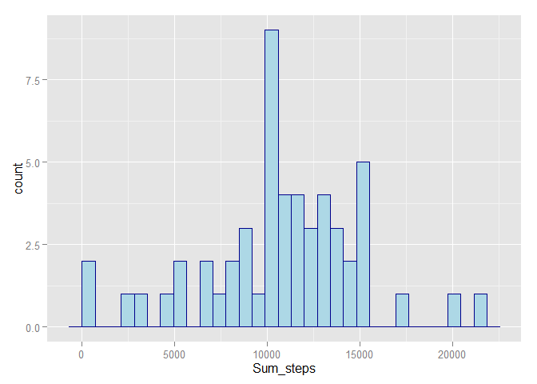
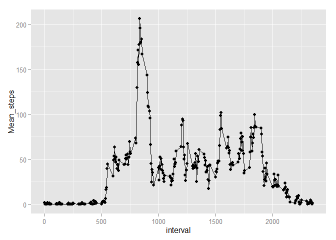
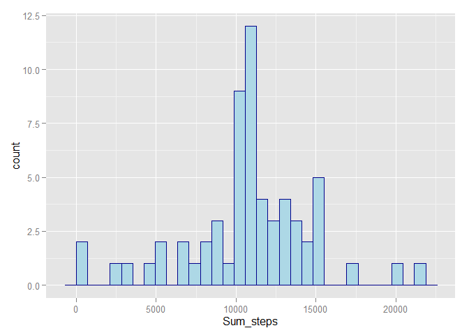
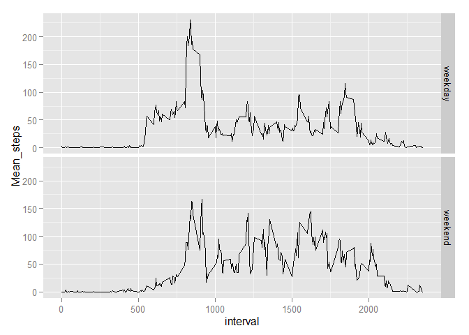

# Reproducible Research: Peer Assessment 1


## Loading and preprocessing the data


```r
# setwd()
activity <- read.csv("./repdata-data-activity/activity.csv")
```

## 1 What is mean total number of steps taken per day?
### 1.1 Calculate the total number of steps taken per day


```r
library(dplyr)
```

```
## Warning: package 'dplyr' was built under R version 3.2.2
```

```
## 
## Attaching package: 'dplyr'
## 
## The following objects are masked from 'package:stats':
## 
##     filter, lag
## 
## The following objects are masked from 'package:base':
## 
##     intersect, setdiff, setequal, union
```

```r
activity_days <- summarise(group_by(activity,date), sum(steps))
colnames(activity_days)[2] <- "Sum_steps"
```

### 1.2 Make a histogram of the total number of steps taken each day


```r
library(ggplot2)        
```

```
## Warning: package 'ggplot2' was built under R version 3.2.1
```

```r
        ggplot(activity_days, aes(x=Sum_steps)) +
                geom_histogram(color="darkblue", fill = "lightblue")
```

```
## stat_bin: binwidth defaulted to range/30. Use 'binwidth = x' to adjust this.
```

 

### 1.3 Calculate and report the mean and median of the total number of steps taken per day


```r
        steps <- activity_days$Sum_steps
        paste("mean is", mean(steps, na.rm = TRUE))
```

```
## [1] "mean is 10766.1886792453"
```

```r
        paste("median is", median(steps, na.rm = TRUE))
```

```
## [1] "median is 10765"
```


## 2 What is the average daily activity pattern?
### 2.1 Make a time series plot (i.e. type = "l") of the 5-minute interval (x-axis) and the average number of steps taken, averaged across all days (y-axis)


```r
        library(dplyr)
       activity <- activity[complete.cases(activity),]
       activity_mean <- summarise(group_by(activity,interval), mean(steps))
       colnames(activity_mean)[2] <- "Mean_steps"
       
        ggplot(data = activity_mean, aes(x=interval, y= Mean_steps)) +                       geom_line(type="l") + geom_point()
```

 

### 2.2 Which 5-minute interval, on average across all the days in the dataset, contains the maximum number of steps?


```r
 filter(activity_mean, Mean_steps ==max(activity_mean$Mean_steps))
```

```
## Source: local data frame [1 x 2]
## 
##   interval Mean_steps
##      (int)      (dbl)
## 1      835   206.1698
```


## 3 Imputing missing values
### 3.1 Calculate and report the total number of missing values in the dataset


```r
activity <- read.csv("./repdata-data-activity/activity.csv")
paste("total NA is", sum(!complete.cases(activity)))
```

```
## [1] "total NA is 2304"
```

### 3.2 Devise a strategy for filling in all of the missing values in the dataset. The strategy does not need to be sophisticated. For example, you could use the mean/median for that day, or the mean for that 5-minute interval, etc.
### 3.3 Create a new dataset that is equal to the original dataset but with the missing data filled in.


```r
# calculate the mean for 5-minute interval, merge the result with original data, replace NA with the corresponding mean

        activity <- read.csv("./repdata-data-activity/activity.csv")        
        
        activity_c <- activity[complete.cases(activity),]
        activity_mean <-                 summarise(group_by(activity_c,interval),mean(steps))
  
        M <- merge(activity, activity_mean, by= "interval")
        M_sort <- arrange(M, date, interval)
        colnames(M_sort)[4] <- "Mean_steps"
        
                for(i in 1:nrow(M_sort)){
                if( is.na(M_sort[i,2]) == TRUE)
                        {
                        M_sort[i,2] <- M_sort[i,4]
                }
        } 
        
activity_s <- M_sort[,c(2:3,1)]
        dim(activity_s)
```

```
## [1] 17568     3
```

```r
        head(activity_s)
```

```
##       steps       date interval
## 1 1.7169811 2012-10-01        0
## 2 0.3396226 2012-10-01        5
## 3 0.1320755 2012-10-01       10
## 4 0.1509434 2012-10-01       15
## 5 0.0754717 2012-10-01       20
## 6 2.0943396 2012-10-01       25
```

### 3.4 Make a histogram of the total number of steps taken each day and Calculate and report the mean and median total number of steps taken per day. Do these values differ from the estimates from the first part of the assignment? What is the impact of imputing missing data on the estimates of the total daily number of steps?


```r
##Histogram
activity_ms <- summarise(group_by(activity_s,date), sum(steps))
colnames(activity_ms)[2] <- "Sum_steps"

ggplot(activity_ms, aes(x=Sum_steps)) +
        geom_histogram(color="darkblue", fill = "lightblue")
```

```
## stat_bin: binwidth defaulted to range/30. Use 'binwidth = x' to adjust this.
```

 

```r
##Mean and Median with NA Fill in
paste("mean with NA fill-in is", mean(activity_ms$Sum_steps))
```

```
## [1] "mean with NA fill-in is 10766.1886792453"
```

```r
paste("median with NA fill-in is",median(activity_ms$Sum_steps))
```

```
## [1] "median with NA fill-in is 10766.1886792453"
```

```r
#vs 
paste("mean removed NA is", mean(steps, na.rm = TRUE))
```

```
## [1] "mean removed NA is 10766.1886792453"
```

```r
paste("median removed NA is", median(steps, na.rm = TRUE))
```

```
## [1] "median removed NA is 10765"
```

```r
## total daily number of steps
paste ("total daily number of steps, without NA filled-in", sum(activity_days$Sum_steps))
```

```
## [1] "total daily number of steps, without NA filled-in NA"
```

```r
#vs
paste ("total daily number of steps, with NA filled-in", sum(activity_ms$Sum_steps))
```

```
## [1] "total daily number of steps, with NA filled-in 656737.509433962"
```


## 4 Are there differences in activity patterns between weekdays and weekends?
### 4.1 Create a new factor variable in the dataset with two levels - "weekday" and "weekend" indicating whether a given date is a weekday or weekend day.


```r
activity_s <- M_sort[,c(2:3,1)]

activity_s$day <- weekdays(as.Date(activity_s$date))


for (i in 1:nrow(activity_s)) {
        if (activity_s[i,4] == "Saturday" | activity_s[i,4] == "Sunday") {
                activity_s$day1[i] = "weekend"
        } else {
                activity_s$day1[i] = "weekday"
        }
}
```


### 4.2 Make a panel plot containing a time series plot (i.e. type = "l") of the 5-minute interval (x-axis) and the average number of steps taken, averaged across all weekday days or weekend days (y-axis).


```r
activity_wkd <- summarise(group_by(activity_s,interval,day1), mean(steps))
colnames(activity_wkd)[3] <- "Mean_steps"

ggplot(activity_wkd,aes(x=interval,y=Mean_steps)) +geom_line() +facet_grid(day1~.)
```

 


